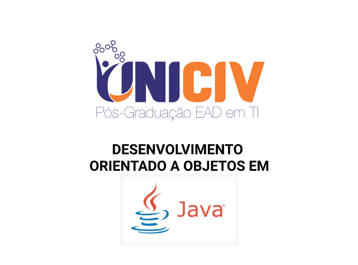

# Pós Graduação UNICIV - Orientação a Objetos com Java

> A pós-graduação UNICIV prepara profissionais de elevado padrão que pretendam atuar em cargos-chaves na programação em Tecnologias Java, nas grandes empresas brasileiras e internacionais.

<!-- De um a dois parágrafos sobre o que é seu projeto e o que ele faz. -->

## Disciplinas

- [Metodologias Ágeis – SCRUM / Kanban / XP / Lean – 30 h](https://github.com/yourname/yourproject/fork)
- [Análise Orientada a Objetos – 30 h](https://github.com/yourname/yourproject/fork)
- [Persistência em Java (JDBC / JPA com Hibernate / Spring Data) – 30 h](https://github.com/yourname/yourproject/fork)
- [Programação para Web usando Java (JSF / PrimeFaces / Hibernate) – 30 h](https://github.com/yourname/yourproject/fork)
- [Gerência de Configuração, Controle de Versão e Mudanças – 30 h](https://github.com/yourname/yourproject/fork)
- [Padrões de Projeto (Design Patterns) – 30 h](https://github.com/yourname/yourproject/fork)
- [Qualidade do Código Fonte (Clean Code) – 30 h](https://github.com/yourname/yourproject/fork)
- [DevOps e Testes Automáticos – 30 h](https://github.com/yourname/yourproject/fork)
- [Tecnologia WebServices e RESTful – 30 h](https://github.com/yourname/yourproject/fork)
- [Containers: Docker e Kubernetes – 30 h](https://github.com/yourname/yourproject/fork)
- [Abordagem de Tecnologias Webmobile – 30 h](https://github.com/yourname/yourproject/fork)
- [Business Intelligence – 30 h](https://github.com/yourname/yourproject/fork)

TOTAL DA CARGA HORÁRIA – 360 h
